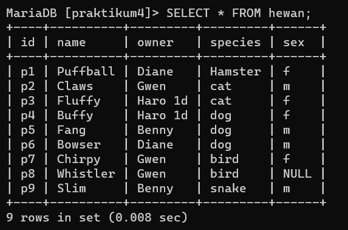

# Praktikum4

```
Nama    : Assandra Julyant Firdausy
NIM     : 312210384
Kelas   : TI.22.A4
```

# Query Filtering

Query filtering merujuk pada proses menyaring atau membatasi hasil query berdasarkan kriteria tertentu.Query filtering memungkinkan kita untuk menentukan kriteria atau kondisi tertentu yang harus dipenuhi oleh data yang akan ditampilkan.Dalam konteks pemrograman dan pengembangan aplikasi, query filtering biasanya dilakukan dengan menggunakan pernyataan atau sintaks yang mendefinisikan kriteria untuk memfilter data. Ini dapat melibatkan penggunaan operator logika seperti "AND" dan "OR", operator perbandingan seperti ">", "<", atau "EQUALS", serta penggunaan klausa seperti "WHERE" dalam SQL untuk membatasi hasil query.

# Tugas Praktikum

- Buat Table pegawai dan isi datanya seperti berikut
  

1. Tampilkan pegawai yang gajinya bukan 2.000.000 dan 1.250.000 !

- Input

```sql
SELECT * FROM pegawai WHERE gaji <> 2000000 AND gaji <> 125000;
```

- Output
  

2. Tampilkan pegawai yang tunjangannya NULL!

- Input

```sql
SELECT * FROM pegawai WHERE tunjangan IS NULL;
```

- Output
  

3. Tampilkan pegawai yang tunjangannya tidak NULL!

- Input

```sql
SELECT * FROM pegawai WHERE tunjangan IS NOT NULL;
```

- Output
  

4. Tampilkan/hitung jumlah baris/record tabel pegawai!

- Input

```sql
SELECT COUNT(*) AS jumlah_baris FROM pegawai;
```

- Output

  

5. Tampilkan/hitung jumlah total gaji di tabel pegawai!

- Input

```sql
SELECT SUM(gaji) AS Jumlah FROM pegawai;
```

- Output

  

6. Tampilkan/hitung rata-rata gaji pegawai!

- Input

```sql
SELECT AVG(gaji) AS rerata FROM pegawai;
```

- Output

  

7. Tampilkan gaji terkecil!

- Input

```sql
SELECT MIN(gaji) AS terkecil FROM pegawai;
```

- Output

  

8. Tampilkan gaji terbesar!

- Input

```sql
SELECT MAX(gaji) AS terbesar FROM pegawai;
```

- Output

  

  # Tugas Praktikum

- Buat table hewan dan isi datanya seperti berikut:


  

1. Tampilkan jumlah hewan yang dimiliki setiap owner.

- Input

```sql
SELECT owner, COUNT(*) AS Jumlah FROM hewan GROUP BY owner;
```

- Output
  

2. Tampilkan jumlah hewan berdasarkan spesies

- Input

```sql
SELECT species, COUNT(*) AS Jumlah FROM hewan GROUP BY species;
```

- Output
  

3. Tampilkan jumlah hewan berdasarkan jenis kelamin

- Input

```sql
SELECT sex, COUNT(*) AS Jumlah FROM hewan GROUP BY sex;
```

- Output
  !

4. Tampilkan jumlah hewan berdasarkan spesies dan jenis kelamin

- Input

```sql
SELECT species, sex, COUNT(*) AS Jumlah FROM hewan GROUP BY species, sex;
```

- Output
  

5. Tampilkan jumlah hewan berdasarkan spesis (cat dan dog saja)
   dan jenis kelamin
   - Input
   
   ```sql
   SELECT species,sex, COUNT(*) AS Jumlah FROM hewan WHERE species IN('Cat','Dog') GROUP BY species,sex;
   ```

- Output

  

6. Tampilkan jumlah hewan berdasarkan jenis kelamin yang diketahui
   saja

   - Input

   ```sql
   SELECT sex, COUNT(*) AS Jumlah FROM hewan WHERE sex IN('f','m') GROUP BY sex;
   ```

   - Output
   
     

# Evaluasi dan Pertanyaan

• Tulis semua perintah-perintah SQL percobaan di atas beserta
outputnya!
• Beri kesimpulan Anda!

- Kesimpulan dari query filtering adalah sebagai berikut:

  1. Query filtering adalah proses menyaring atau membatasi hasil query berdasarkan kriteria tertentu.
  2. Query filtering digunakan untuk mendapatkan data yang spesifik dan relevan dengan kebutuhan kita.
  3. Query filtering melibatkan penggunaan operator logika, operator perbandingan, dan klausa seperti "WHERE" dalam SQL.
  4. Query filtering memungkinkan kita untuk menentukan kondisi atau kriteria tertentu yang harus dipenuhi oleh data yang akan ditampilkan.
  5. Contoh penggunaan query filtering meliputi memfilter data berdasarkan nilai tertentu, memfilter data berdasarkan kategori, dan memfilter data berdasarkan hubungan dengan data lainnya.